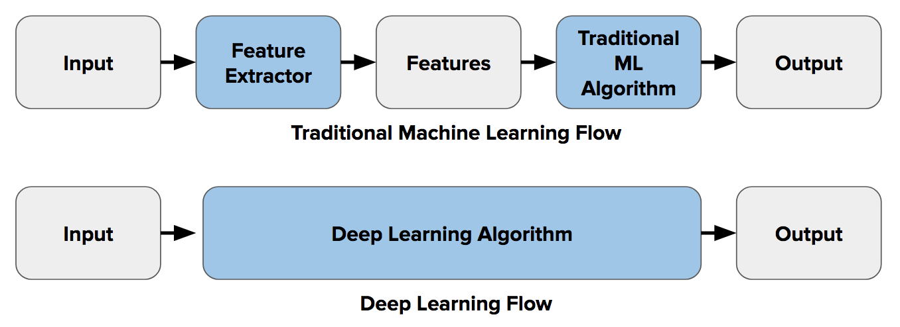

# ML-vs-DL

# Overview
This is a 5 part series in which I compare the preformance of Deep Learning to that of sklearn models for individual use cases.

As of now I plan on doing the folowing use cases, I've already started on the first one...

* Tanzania Water Well
* Flagging AI generated articles
* Covid Cough Detection 
* Sentiment Analysis towards artists
* Text Helpfulness, predict helpfulness of customer reviews
